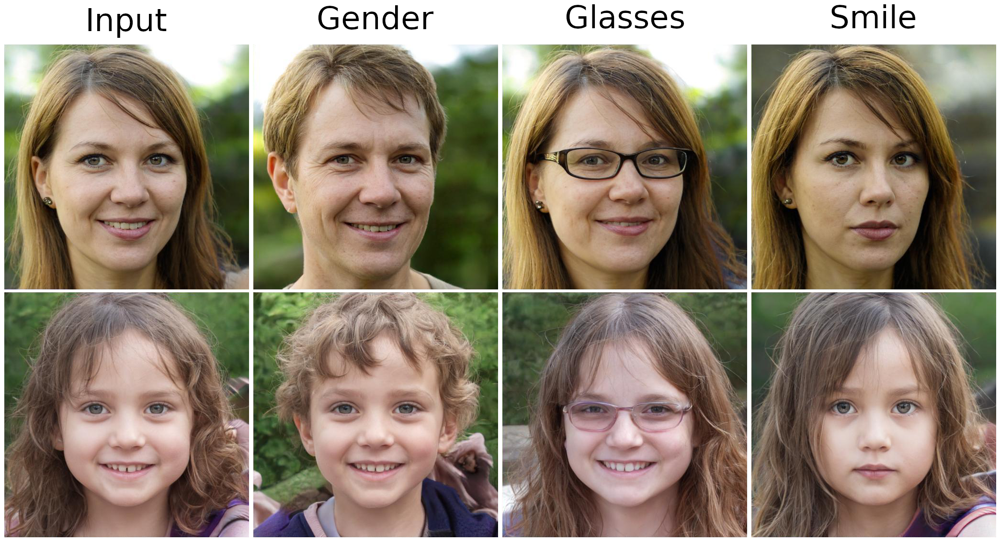

# PluGeN: Multi-Label Conditional Generation From Pre-Trained Models

This repository contains the official code for PluGeN, a method for adapting pre-trained models for conditional multi-label generation. This work was presented at AAAI 2022.

[[Paper](https://arxiv.org/abs/2109.09011)] [[Website](https://gmum.github.io/plugen)]




## Abstract
Modern generative models achieve excellent quality in a variety of tasks including image or text generation and chemical molecule modeling. However, existing methods often lack the essential ability to generate examples with requested properties, such as the age of the person in the photo or the weight of the generated molecule. Incorporating such additional conditioning factors would require rebuilding the entire architecture and optimizing the parameters from scratch. Moreover, it is difficult to disentangle selected attributes so that to perform edits of only one attribute while leaving the others unchanged. To overcome these limitations we propose PluGeN (Plugin Generative Network), a simple yet effective generative technique that can be used as a plugin to pre-trained generative models. The idea behind our approach is to transform the entangled latent representation using a flow-based module into a multi-dimensional space where the values of each attribute are modeled as an independent one-dimensional distribution. In consequence, PluGeN can generate new samples with desired attributes as well as manipulate labeled attributes of existing examples. Due to the disentangling of the latent representation, we are even able to generate samples with rare or unseen combinations of attributes in the dataset, such as a young person with gray hair, men with make-up, or women with beards. We combined PluGeN with GAN and VAE models and applied it to conditional generation and manipulation of images and chemical molecule modeling. Experiments demonstrate that PluGeN preserves the quality of backbone models while adding the ability to control the values of labeled attributes.


## Code
The code is divided into three directories containing code for three different types of experiments:
* `CharVAE/` – experiments on the ZINC 250k dataset using the CharVAE backbone.
* `StyleGAN/` – experiments on the FFHQ dataset using the StyleGAN backbone. 
* `VAE/` – experiments on the CelebA dataset using the VAE backbone

## Citation
```
@misc{wołczyk2022plugen,
      title={PluGeN: Multi-Label Conditional Generation From Pre-Trained Models}, 
      author={Maciej Wołczyk and Magdalena Proszewska and Łukasz Maziarka and Maciej Zięba and Patryk Wielopolski and Rafał Kurczab and Marek Śmieja},
      year={2022},
      eprint={2109.09011},
      archivePrefix={arXiv},
      primaryClass={cs.LG}
}
```
